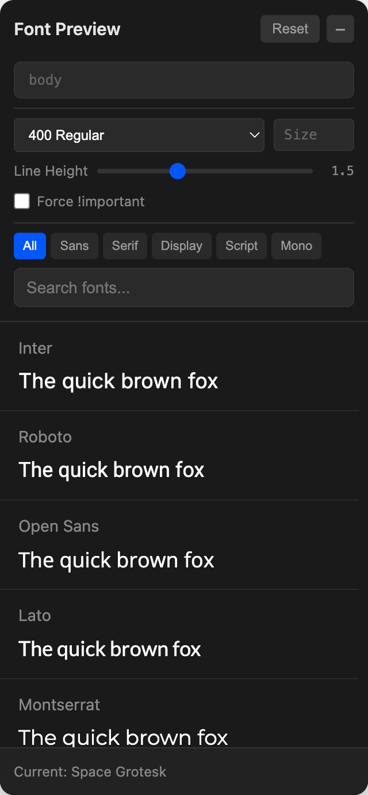

# Google Font Tester

A lightweight widget for previewing Google Fonts on any website. Add one line of code and get a floating font picker that lets you instantly test 80+ popular fonts.



## Installation

Add this to your HTML:

```html
<script src="https://cdn.jsdelivr.net/gh/draganbabic/google-font-tester@main/google-font-tester.js"></script>
```

That's it. A small "Aa" button will appear in the bottom-right corner of your page.

## Bookmarklet

Want to test fonts on any website without editing code? Create a bookmarklet:

1. Create a new bookmark in your browser
2. Name it "Font Tester"
3. Paste this as the URL:

```javascript
javascript:(function(){var s=document.createElement('script');s.src='https://cdn.jsdelivr.net/gh/draganbabic/google-font-tester@main/google-font-tester.js';document.body.appendChild(s);})();
```

4. Visit any website and click the bookmark to activate the font tester

## Features

- 80+ popular Google Fonts
- Filter by category: Sans, Serif, Display, Script, Mono
- Search fonts by name
- **Custom CSS selector** - target specific elements (defaults to `body`)
- **Font weight** - select from 300 (Light) to 900 (Black)
- **Font size** - enter any value (e.g., `16`, `1.5rem`, `14px`)
- **Line height** - adjustable slider
- **Force !important** - override existing styles when needed
- Live preview - changes apply instantly as you adjust settings
- Lazy-loads fonts as you scroll for performance
- Reset button to restore all original styles
- Dark theme UI
- Zero dependencies
- Nothing persists - refresh to reset

## Use Cases

- Designers exploring font options for a project
- Developers testing font readability
- Quick font comparisons without editing CSS

## License

MIT
